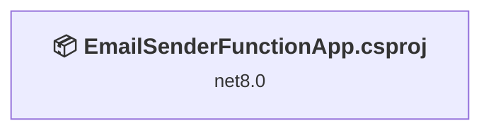
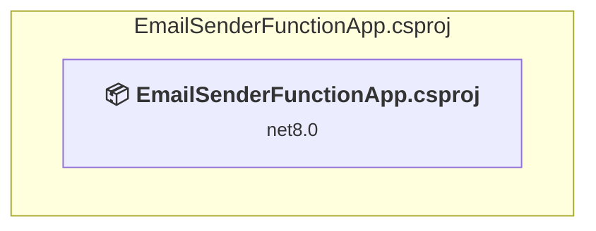

# Projects and dependencies analysis

This document provides a comprehensive overview of the projects and their dependencies in the context of upgrading to .NETCoreApp,Version=v10.0.

## Table of Contents

- [Executive Summary](#executive-Summary)
  - [Highlevel Metrics](#highlevel-metrics)
  - [Projects Compatibility](#projects-compatibility)
  - [Package Compatibility](#package-compatibility)
  - [API Compatibility](#api-compatibility)
- [Aggregate NuGet packages details](#aggregate-nuget-packages-details)
- [Top API Migration Challenges](#top-api-migration-challenges)
  - [Technologies and Features](#technologies-and-features)
  - [Most Frequent API Issues](#most-frequent-api-issues)
- [Projects Relationship Graph](#projects-relationship-graph)
- [Project Details](#project-details)

  - [EmailSenderFunctionApp\EmailSenderFunctionApp.csproj](#emailsenderfunctionappemailsenderfunctionappcsproj)

## Executive Summary

### Highlevel Metrics

| Metric | Count | Status |
| :--- | :---: | :--- |
| Total Projects | 2 | All require upgrade |
| Total NuGet Packages | 5 | 3 need upgrade |
| Total Code Files | 2 |  |
| Total Code Files with Incidents | 2 |  |
| Total Lines of Code | 122 |  |
| Total Number of Issues | 6 |  |
| Estimated LOC to modify | 1+ | at least 0.8% of codebase |

### Projects Compatibility

| Project | Target Framework | Difficulty | Package Issues | API Issues | Est. LOC Impact | Description |
| :--- | :---: | :---: | :---: | :---: | :---: | :--- |
| [EmailSenderFunctionApp\EmailSenderFunctionApp.csproj](#emailsenderfunctionappemailsenderfunctionappcsproj) | net8.0 | 🟢 Low | 3 | 1 | 1+ | AzureFunctions, Sdk Style = True |

### Package Compatibility

| Status | Count | Percentage |
| :--- | :---: | :---: |
| ✅ Compatible | 2 | 40.0% |
| ⚠️ Incompatible | 0 | 0.0% |
| 🔄 Upgrade Recommended | 3 | 60.0% |
| ***Total NuGet Packages*** | ***5*** | ***100%*** |

### API Compatibility

| Category | Count | Impact |
| :--- | :---: | :--- |
| 🔴 Binary Incompatible | 0 | High - Require code changes |
| 🟡 Source Incompatible | 0 | Medium - Needs re-compilation and potential conflicting API error fixing |
| 🔵 Behavioral change | 1 | Low - Behavioral changes that may require testing at runtime |
| ✅ Compatible | 280 |  |
| ***Total APIs Analyzed*** | ***281*** |  |

## Aggregate NuGet packages details

| Package | Current Version | Suggested Version | Projects | Description |
| :--- | :---: | :---: | :--- | :--- |
| Azure.Identity | 1.17.1 |  | [EmailSenderFunctionApp.csproj](#emailsenderfunctionappemailsenderfunctionappcsproj) | ✅Compatible |
| Microsoft.Azure.Functions.Worker | 1.21.0 | 2.51.0 | [EmailSenderFunctionApp.csproj](#emailsenderfunctionappemailsenderfunctionappcsproj) | NuGet package upgrade is recommended |
| Microsoft.Azure.Functions.Worker.Extensions.Http | 3.1.0 | 3.3.0 | [EmailSenderFunctionApp.csproj](#emailsenderfunctionappemailsenderfunctionappcsproj) | NuGet package upgrade is recommended |
| Microsoft.Azure.Functions.Worker.Sdk | 1.17.0 | 2.0.7 | [EmailSenderFunctionApp.csproj](#emailsenderfunctionappemailsenderfunctionappcsproj) | NuGet package upgrade is recommended |
| Microsoft.Graph | 5.48.0 |  | [EmailSenderFunctionApp.csproj](#emailsenderfunctionappemailsenderfunctionappcsproj) | ✅Compatible |

## Top API Migration Challenges

### Technologies and Features

| Technology | Issues | Percentage | Migration Path |
| :--- | :---: | :---: | :--- |

### Most Frequent API Issues

| API | Count | Percentage | Category |
| :--- | :---: | :---: | :--- |
| T:Microsoft.Extensions.Hosting.HostBuilder | 1 | 100.0% | Behavioral Change |

## Projects Relationship Graph

Legend:
📦 SDK-style project
⚙️ Classic project

## Project Details

### EmailSenderFunctionApp\EmailSenderFunctionApp.csproj

#### Project Info

- **Current Target Framework:** net8.0
- **Proposed Target Framework:** net10.0
- **SDK-style**: True
- **Project Kind:** AzureFunctions
- **Dependencies**: 0
- **Dependants**: 0
- **Number of Files**: 2
- **Number of Files with Incidents**: 2
- **Lines of Code**: 122
- **Estimated LOC to modify**: 1+ (at least 0.8% of the project)

#### Dependency Graph

Legend:
📦 SDK-style project
⚙️ Classic project

### API Compatibility

| Category | Count | Impact |
| :--- | :---: | :--- |
| 🔴 Binary Incompatible | 0 | High - Require code changes |
| 🟡 Source Incompatible | 0 | Medium - Needs re-compilation and potential conflicting API error fixing |
| 🔵 Behavioral change | 1 | Low - Behavioral changes that may require testing at runtime |
| ✅ Compatible | 280 |  |
| ***Total APIs Analyzed*** | ***281*** |  |

